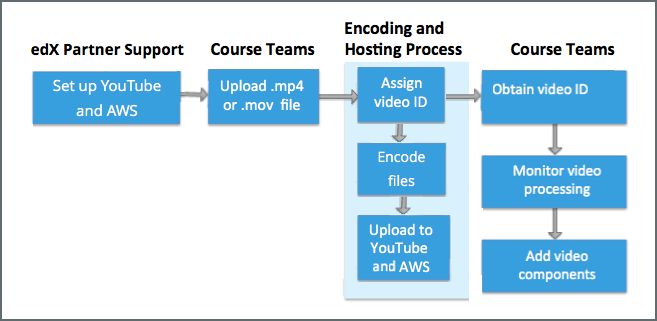
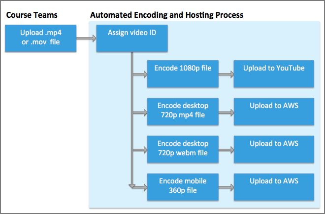
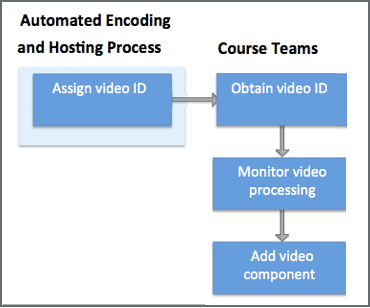

.. _Video Processing Overview:

###########################
Video Processing Overview
###########################

.. note::
  This process applies only to courses that run on the edx.org site. For
  information about adding video files to courses that run on Edge, see
  :ref:`Step 3. Upload a Video for an edx Edge Course <Post the Video Online>`.

This section provides an overview of the video process for edX partners. The
following diagram shows a simplified view of this process.

.. image:: ../../../../shared/images/encoding_process_overview.png
 :width: 700
 :alt: Flowchart of a course team uploading a video, followed by edX assigning
     a video ID, encoding and uploading the video in different formats to
     YouTube and AWS, and providing the video ID to the course team. The course
     team monitors processing and adds the video to a course.

This process creates a single video ID for each video that includes files for
each of the different video formats as well as the hosting services for these
files. For more information, see the following sections.

.. important::
 The edX automation process does not include captioning services. Your course
 teams use your organization's current workflow to generate transcripts for
 your video files and then add the transcripts to the video in Studio. For more
 information, see :ref:`Add a Video Transcript`.

.. contents::
  :local:
  :depth: 1

************************************
Course Team Video Upload Overview
************************************

First, the edX partner support team works with the appointed video
administrators from your organization to establish accounts for your
organization at YouTube™ and Amazon Web Services™ (AWS). For more information
about the preliminary setup that your institution works with edX to complete,
see :ref:`Video Getting Started`.

After these services are set up, course teams use Studio to upload one file to
the edX servers for each of the videos that they want to include in their
course. For more information, see :ref:`Uploading Videos in Studio`.

.. _Video Encoding and Hosting Overview:

************************************
Video Encoding and Hosting Overview
************************************

After a member of a course team uploads a video file to the edX servers
successfully, the automated encoding and hosting process starts. This process
creates additional file formats and transfers the files to YouTube and AWS
accounts to ensure optimal playback quality for course videos.

     video ID and then transcoding it into four formats and transferring the
     results to YouTube and AWS.

.. important:: The automated encoding and hosting process takes up to **24
   hours** to complete.

If a step fails to complete successfully the process includes multiple
automated retries.

Course teams can track the status of each video file on the Studio **Video
Uploads** page as the videos go through automated processing.

.. note::
 The edX automation process does not include captioning services. Your course
 teams use your institution's current workflow to generate transcripts for your
 video files, and then add them to the video in Studio. For more information,
 see :ref:`Add a Video Transcript`.

************************************
Course Team Add Video Overview
************************************

In Studio, course teams can monitor the progress of each video that they upload
and obtain the unique video ID for the video. After the automation process is
complete and the encoded video files reach the edX servers successfully, the
video that the course team uploaded has a status of "Ready". The course team
can then add the video ID and the video transcript to a video component in the
course outline. For more information, see :ref:`Adding Videos to a Course`.

     teams obtaining the video IDs, monitoring the process, and adding video
     components in the course.

When a learner uses the edX video player or the edX mobile app to access a
course video, the video ID is what provides the connection to the URLs that
host each differently encoded version of the original video file. For
information about ensuring that your videos are available to learners who use
the edX mobile apps, see :ref:`installation:Configuring Video Modules for
Mobile`.

The course team can add a video to their course as soon as its unique video ID
is assigned, and the video plays in the LMS as soon as its status is Ready.
However, processing takes 24 hours to complete for all encodings and all video
hosting sites.
